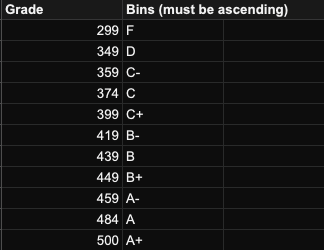

# GradeView Web Application

## About

This application was created using Node, Express, and React by Connor Bernard at the University of California, Berkeley for the sake of displaying student grade information for the classes CS10 "The Beauty and Joy of Computing" and CS61C "Great Ideas in Computer Architecture (Machine Structures)."

## SPREADSHEET SETUP

- The first column should be the student's name
- The second column should be the student's email
- The first row should be the titles of the homework assignments for that column
- The second row should be the type of assignment
- The third row should be the maximum amount of points the assignment is out of
- The bin page should have two columns and be ascending with the leftmost column being points and the rightmost being letter grade as shown below



## Configuration

### SERVER CONFIG

1. Open the /api/config/default.json config file
2. Fill out the server section with the port of the API
3. Fill in the spreadsheet section with:
    1. The spreadsheet ID (found in the sheet URL)
    2. The scopes (only change this if the API needs more than readonly access)
4. Fill out the pages subsection of spreadsheet with:
    1. The gradepage (the page with the grade data on it) and:
        1. `pagename`: The name of the sheet with the grade data
        2. `assignmentMetaRow`: The row that the assignment metadata starts on
        3. `startrow`: The row where student information starts
        4. `startcol`: The column where student information starts
    2. The binpage (the page with the bins on it) and:
        1. `pagename`: the name of the page with the bins on it
        2. `startcell`: the top left cell of the bins (point value for F)
        3. `endcell`: the bottom right cell of the bins (letter value for A+)
5. Add all necessary admin emails to the admin whitelist

__NOTE: If your API server's origin is different from your live website's origin, you will have to set the `REACT_APP_PROXY_SERVER` environment variable equal to the respective URL in /.env.__

## Use

### LOCALLY WITH DOCKER

1. In the root directory run `make docker`

OR

1. Navigate to the root directory
2. Build a dockerfile with `docker-compose build`
3. Run the dockerfile with `docker-compose start` (or `docker-compose up` to see console output in console)

### LOCALLY WITH NODE

1. __[First use only]:__ In the root directory run `make init`
2. In the root directory run `make npm` to start the service

Note: Running these will start both an api server as well as a website

## Database

### ACCESS DATABASE
1. To access the cli when the container is running:\
`docker exec -it gradeview-redis-1 redis-cli`
2. First command is to enter the password. The password is stored in the root .env file as REDIS_DB_SECRET\
`AUTH {value of REDIS_DB_SECRET}`

### RETRIEVE DATA
1. Select which data to use - since we only have the data from the Google Sheet, it is populated to the 0 index, so type:\
`SELECT 0`
2. To list out all of the keys in this database:\
`KEYS *`
3. To access the data for the assignment:concept mapping:\
`GET Categories`\
This returns a JSON in the following format:
```
“{\“Quest 1\“:
    {\“Abstraction\“: \“2\“, \“Number Representation\“: \“4\“, \“Iteration\“: \“6\“, \“Domain and Range\“: \“6“, \“Booleans\“: \“6\“, \“Functions\“: \“4\“, \“HOFs I\“: \“12\“}
}”
```
4. To access a students data, use their email. For example:\
`GET dahluwalia@berkeley.edu`\
This returns a JSON in the following format:
```    
“{\“Legal Name\“: \“Ahluwalia, Dev\“,
  \“Assignments\“:
         {\“Quest 1\“:
             {\“Abstraction\“: 2, \“Number Representation\“: 4, \“Iteration\“: 6, \“Domain and Range\“: 6, \“Booleans\“: 6, \“Functions\“: 4, \“HOFs I\“: 12}
         }
}”
```